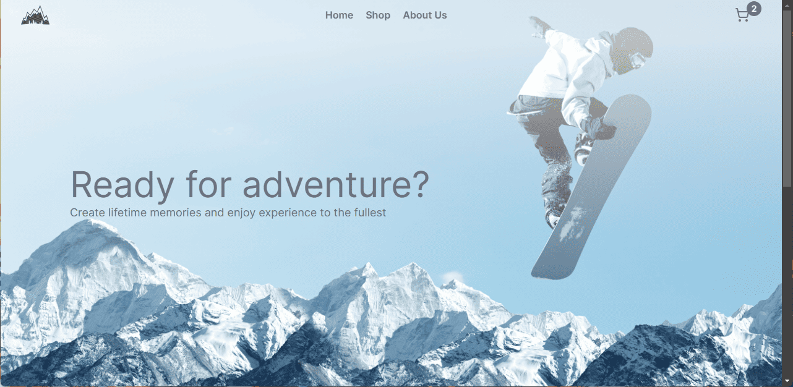
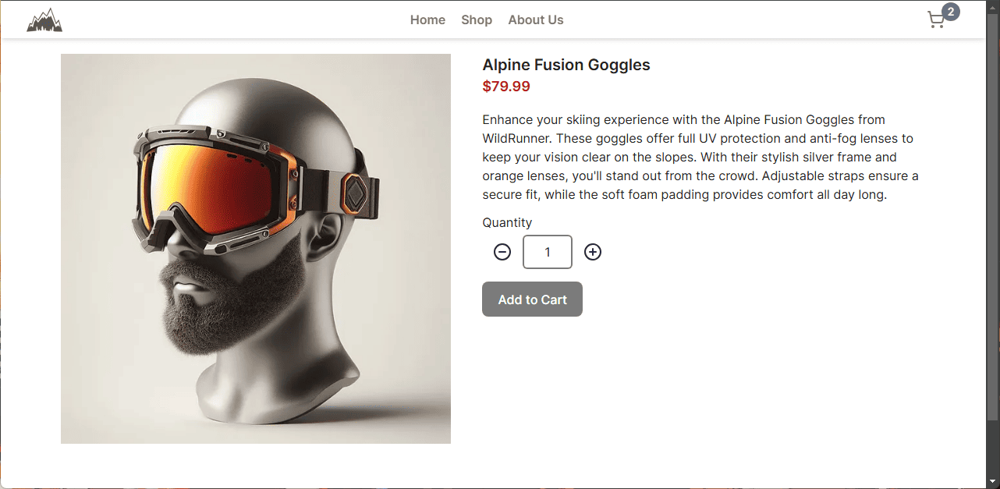

# Alpinus - Outdoor Equipment Shop App

A mock e-commerce site built in using React, React Router and React Testing Library. This e-commerce sell any products based on outdoor activity. The product data and images is taken from this [repository](https://github.com/dotnet/eShop).




_Note:_
**Checkout page/feature is not available**. It is only for front-end purpose and has been built from home page until cart page.

## Structure of App

1. Root component for main layout of App that contained header, main content and footer and act as parent route.
2. In the main content, we passed each page on there and act as children route of root component.
3. The shop page act as parent route to display product component, so when we use the filter features on shop page, it will re-render only the products (display product component) we want to see (not entire the shop page itself).

## Features

- Multi filter for each brand on shop page to filter products.
- Link to each page and product category.
- Display total product that had been filled into cart on the top right corner of cart icon.
- Update product quantity and remove product on both product page and cart page.
- Toast notification to notify user if the product has been added, updated or removed.

## Installation

1. Clone this repository.

```
git clone git@github.com:tingtung46/outdoor-equipment-shop.git
```

2. Navigate to the project directory.

```
cd outdoor-equipment-shop
```

3. Install all dependencies.

```
npm install
```

4. Run the dev server to display the project.

```
npm run dev
```
